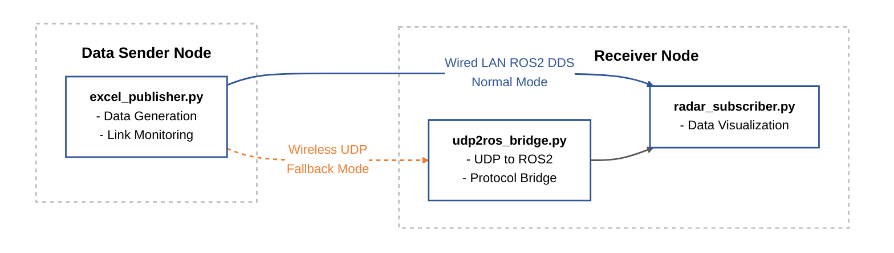

# onDevice: 감시장비 탑재형 환경 적응형 온디바이스 SW

‘무인이동체 감시장비에 탑재되는 환경 적응형 온디바이스 소프트웨어 기술 개발’ 과제는 고장 및 통신 단절 등 극한 환경에서도 임무를 지속할 수 있는 지능형 온디바이스 소프트웨어 시스템(ENOS)을 개발하는 것을 목표로 합니다.

    

---

## Current Release (v1.0): ROS2/DDS Network Middleware
**2차년도 개발 성과**: 이기종 네트워크 간 통신 절체 및 데이터 브릿지 모듈

현재 공개된 버전은 ENOS의 핵심 인프라인 통신 미들웨어 파트입니다. ROS2 기반의 데이터 파이프라인을 통해 유선(LAN)과 무선(UDP/6LoWPAN) 망을 유연하게 연동하고, 통신 단절 시 자동으로 경로를 복구하는 기능을 제공합니다.

### Key Modules
| 모듈명 | 파일명 | 설명 |
| :--- | :--- | :--- |
| **Data Publisher** | excel_publisher.py | • 시뮬레이션 데이터를 생성하여 ROS2 Topic으로 발행 • Adaptive Switching: LAN 연결 해제 시 자동으로 UDP 모드로 전환하여 전송 지속 |
| **Heterogeneous Bridge** | udp2ros_bridge.py | • Protocol Conversion: UDP로 수신된 패킷을 ROS2 메시지로 실시간 복원 • 이기종 장비 간 데이터 투명성 보장 |
| **Radar Subscriber** | radar_subscriber.py | • 최종 수신된 레이더/센서 데이터를 모니터링 및 시각화 |

### Architectures & Features
본 시스템은 ROS2 Humble 및 FastDDS를 기반으로 동작하며, 다음과 같은 핵심 기능을 포함합니다.
- **Failover Logic**: 유선망 장애 감지 시 0.5초 이내에 보조망으로 절체
- **Lightweight Protocol**: 엣지 디바이스 환경에 최적화된 경량 패킷 구조 설계
- **Cross-Platform**: Linux 및 ROS2 지원 환경에서 즉시 구동 가능

※ 상세한 실행 방법 및 빌드 가이드는 middleware 폴더 내부의 README를 참조하십시오.

---

## Project Overview

### 개요
‘감시장비 탑재형 환경 적응형 온디바이스 소프트웨어 시스템(이하 ENOS)’은 무인이동체 감시장비에 탑재되어 환경 변화에 적응적으로 대응하며 임무를 수행하는 지능형 시스템입니다.

### 핵심 목표
- **감시장비의 지능화:** 자율적 임무 수행 능력 확보
- **운용 안정성:** 통신 단절 등 극한 환경에서의 생존성 보장
- **협업 효율성:** 다중 장비 간 자원 공유 및 연동

### 주요 기능
- **그룹 관리 및 통신:** 네트워크 자가 복구 및 극한 환경 대응 통신 체계
- **자원 관리:** 실시간 상태 모니터링 및 레거시 시스템 자원 통합
- **임무 수행:** 동적 지능 기반(PatchTST 등) 위험 예측 및 임무 재구성
- **시스템 연동:** 지휘 통제 시스템과의 표준 연동 인터페이스 제공

---
**Maintained by:** ETRI onDevice Team
